 > As you complete each section you **must** remove the prompt text. Every *turnin* of this project includes points for formatting of this README so keep it clean and keep it up to date. 
 > Prompt text is any lines beginning with "\>"
 > Replace anything between \<...\> with your project specifics and remove angle brackets. For example, you need to name your project and replace the header right below this line with that title (no angle brackets). 
# UC SOCAL LOVE QUEST 
 > Authors: [Jayne Tan](https://github.com/jaynjsijsh), [Ryan Diaz](https://github.com/DBChrono), [Laura Canon](https://github.com/lscanon), [Riya Kandalgaonkar](https://github.com/riyak4)
 
## Project Description
 > * Project Description:
 >   * This project explores the different dating options and stereotypes of the UC’s in Southern California as we create personalities for each of the UC’s. The player (new transfer student) will have the opportunity to choose between multiple text options and depending on the players choice, it can either make the characters like or dislike the player. At the end of the game, the mascot the player matches with the most will be the school they transfer to. 
 > * Why is it important or interesting to you?
 >   * As a SoCal UC student, we would like to explore dating opportunities. We want to explore developing a choice based game
 > * What languages/tools/technologies do you plan to use? (This list may change over the course of the project)
 >   * C++ on VSCode, Git and Github
 > * What will be the input/output of your project?
 >   * Input and output through the terminal, the player will get different options and they choose based on that
 > * What are the features that the project provides?
 >   * Branching dialogue trees: Depending on the player’s option of dialogue, the character’s response will change and reflect the option.
 >   * Inclusion of mood points: The mood points will be a numeric value that display the affection character has for the player 
 >   * Character interactions with input: The player will get different dialogue options and they choose based on the user pressing assigned keys from the keyboard(i.e. {Dialogue Option 1} (Press “1”),{Dialogue Option 2} (Press “2”))
 >   * Labeled Choices: Have choices labeled something like this format [Menu - Press M, Talk to {character} - Press E, Quit - Press Q ]
 >   * Menu option: After an event sequence (when the character’s done responding to any dialogue) player will have a choice 
 >   * Optional: Day/NightCycle; after three conversations with a character, a full day has passed ;; Itemization: Player can give gifts to character to raise mood points after completing some events, gift giving will raise up/down depending on if they are compatible with gift

 > ## Phase IIs
## User Interface Specification

### Navigation Diagram

### Screen Layouts

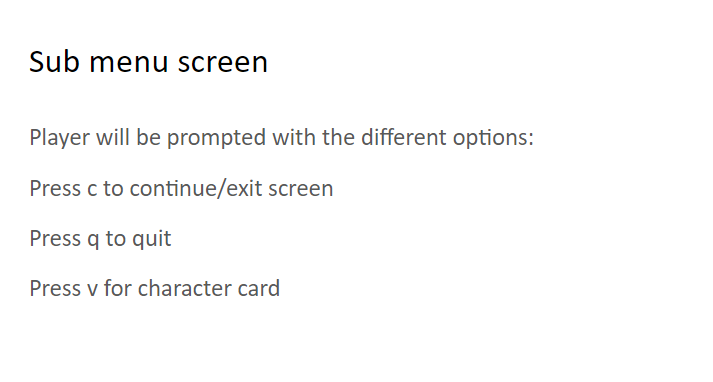

## Class Diagram
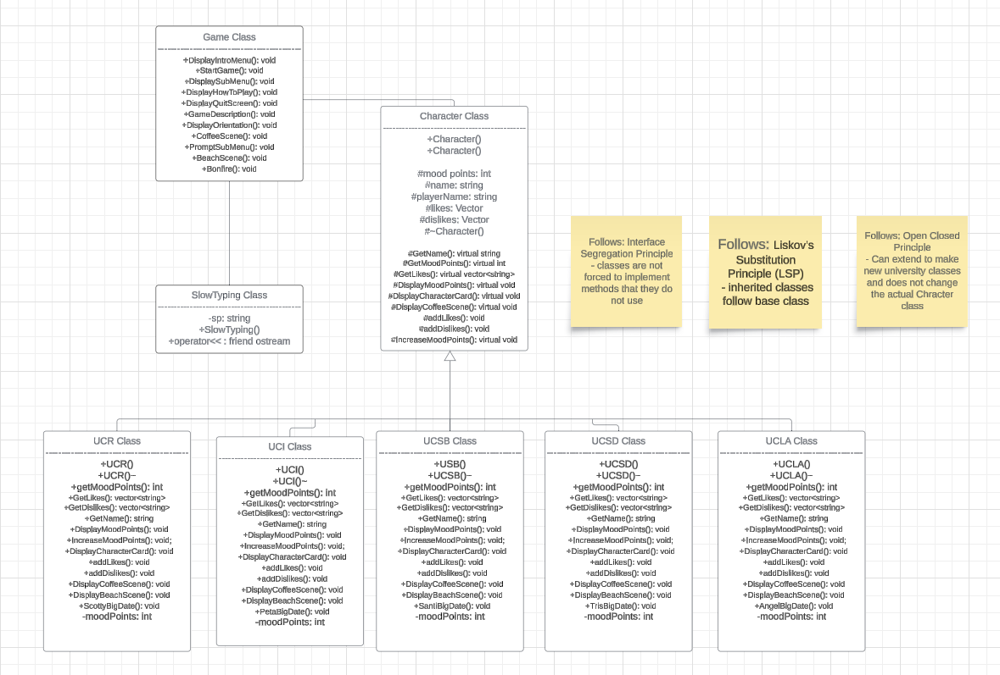
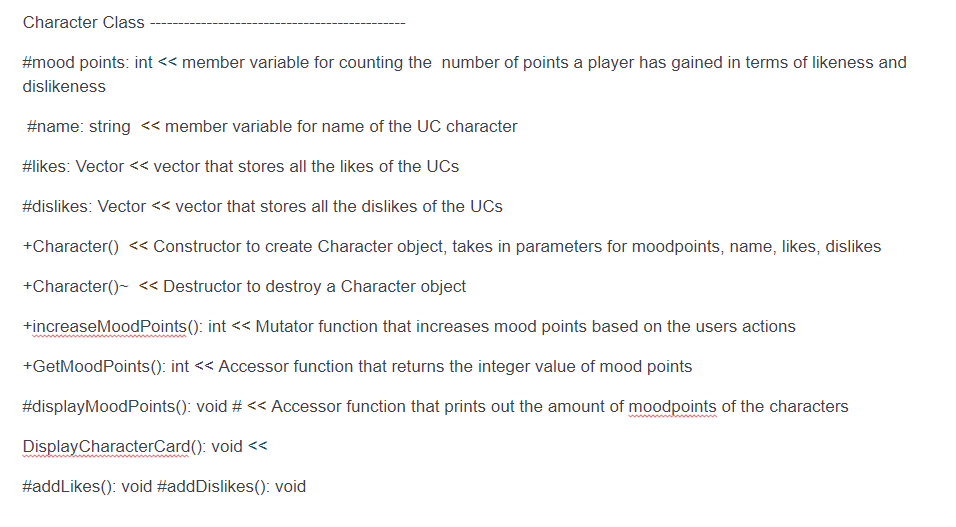
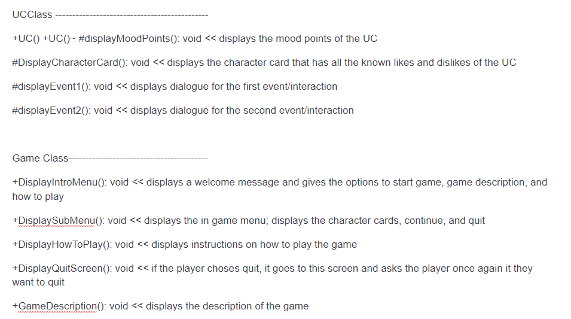
 
 > ## Phase III
 > You will need to schedule a check-in for the second scrum meeting with the same reader you had your first scrum meeting with (using Calendly). Your entire team must be present. This meeting will occur on week 8 during lab time.
 
 > BEFORE the meeting you should do the following:
 > * Update your class diagram from Phase II to include any feedback you received from your TA/grader.
 > * Considering the SOLID design principles, reflect back on your class diagram and think about how you can use the SOLID principles to improve your design. You should then update the README.md file by adding the following:
 >   * A new class diagram incorporating your changes after considering the SOLID principles.
 >   * For each update in your class diagram, you must explain in 3-4 sentences:
 >     * What SOLID principle(s) did you apply?
 > The solid principles are written in our UML diagram, we used Interface Segregation principle so that our classes are not forced to implement methods that they do not do, such as repeating functions or unnecessary functions, as well as Liskov's Substitution Principle where we inherited our UC classes from the character class, as well as Open Closed Principle where we can extend our UC classes without having it affect our parent character class. 
 >     * How did this change help you write better code? 
 > The solid principles helped organize our diagram and kept it efficient and effective, we are able to adjust our classes so that they have relevant functions to their class, were able to effectively inherit from another class, and be able to extend from those derived classes without affecting the base class.
 > * Perform a new sprint plan like you did in Phase II.
 > * You should also make sure that your README file (and Project board) are up-to-date reflecting the current status of your project and the most recent class diagram. Previous versions of the README file should still be visible through your commit history.

 
>
 
 > ## Final deliverable
 > All group members will give a demo to the reader during lab time. ou should schedule your demo on Calendly with the same reader who took your second scrum meeting. The reader will check the demo and the project GitHub repository and ask a few questions to all the team members. 
 > Before the demo, you should do the following:
 > * Complete the sections below (i.e. Screenshots, Installation/Usage, Testing)
 > * Plan one more sprint (that you will not necessarily complete before the end of the quarter). Your In-progress and In-testing columns should be empty (you are not doing more work currently) but your TODO column should have a full sprint plan in it as you have done before. This should include any known bugs (there should be some) or new features you would like to add. These should appear as issues/cards on your Project board.
 > * Make sure your README file and Project board are up-to-date reflecting the current status of your project (e.g. any changes that you have made during the project such as changes to your class diagram). Previous versions should still be visible through your commit history. 
 
 ## Screenshots
 > Screenshots of the input/output after running your application
 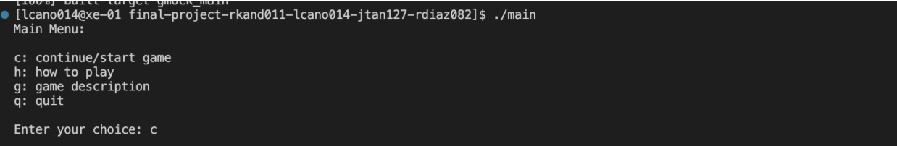
 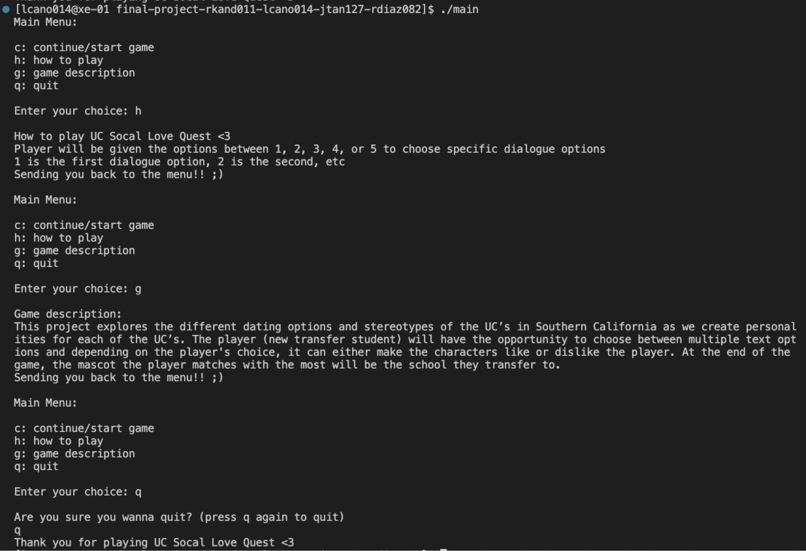
 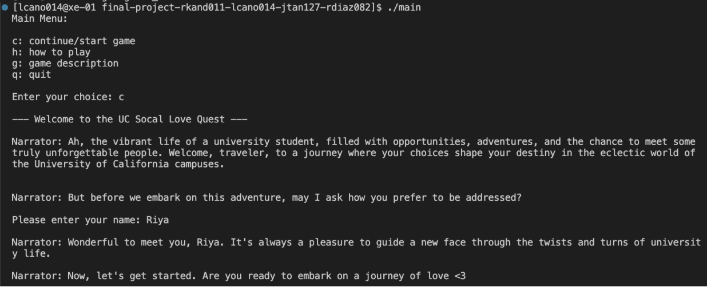
 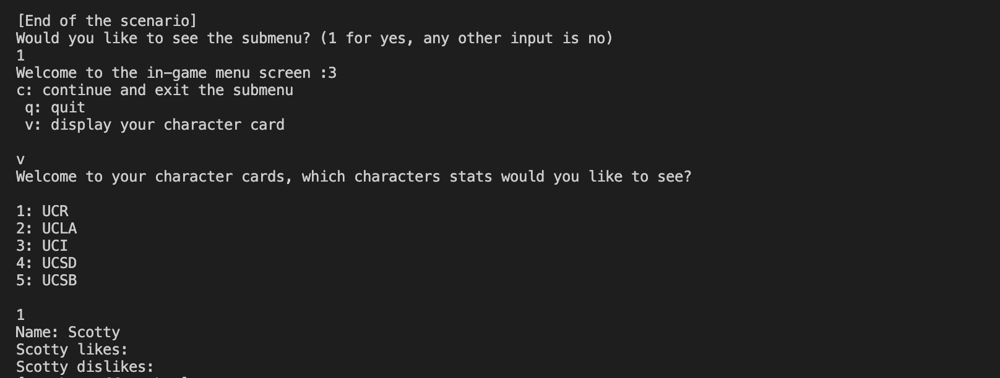

 ## Installation/Usage
 > Instructions on installing and running your application
 > To run our code, you must run the following commands: "cmake .", "make" and "run ./main". Once you do this, the rest of the commands depend on the user but will be prompted by the game, "1. option 1", "2. option 2". 
 ## Testing
 > How was your project tested/validated? If you used CI, you should have a "build passing" badge in this README.
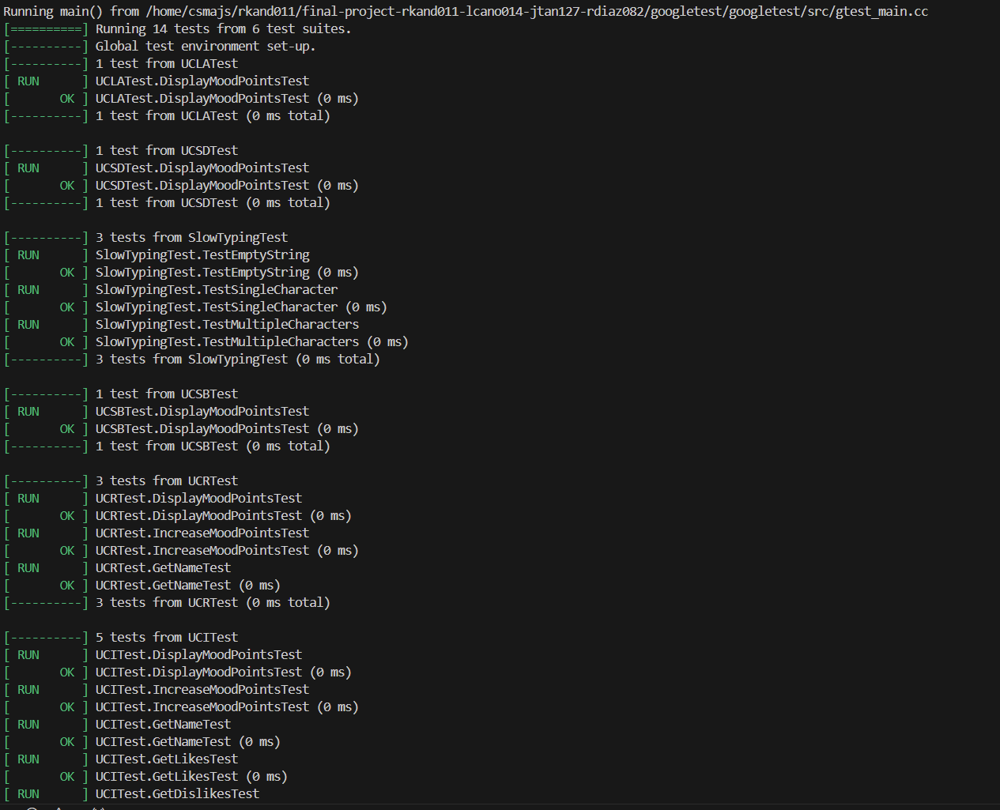 

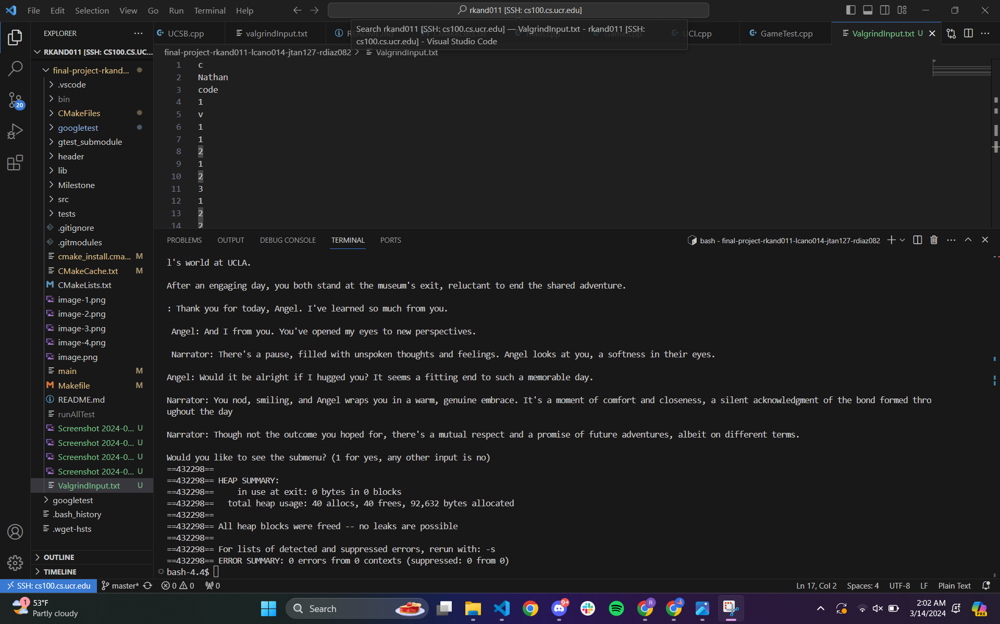
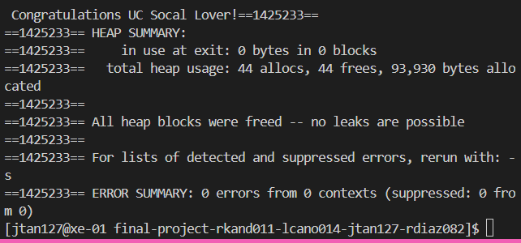